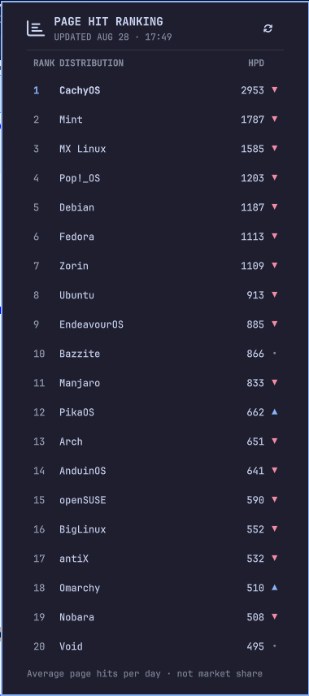

# DistroWatch Rankings

A minimalist Omarchy bar widget for the [DistroWatch Page Hit Ranking](https://distrowatch.com/dwres.php?resource=popularity).



The popup shows the top 20 distributions from DistroWatch's six-month table, including average hits per day (HPD) and the direction of each value compared with the previous day.

## Development disclosure

AI coding tools helped design, write, and review this project. I chose the
requirements and remain responsible for the published code.

## Install

```sh
omarchy plugin add https://github.com/rafzzzzzz/omarchy-distrowatch.git --enable
```

The widget defaults to the right section of the bar. Move it at any time with:

```sh
omarchy bar move io.github.rafzzzzzz.distrowatch --section right
```

## Usage

Click the chart icon to open the ranking panel. Click a distribution to open its DistroWatch page. The header includes an action to refresh the data.

Data refreshes when the plugin starts and every six hours. A failed request falls back to the last successful response and marks it as cached.

## Requirements

- Omarchy Quattro
- Python 3 standard library
- An internet connection for fresh rankings
- `omarchy-launch-browser`, included with Omarchy

No Python packages or additional system dependencies are required.

## Data And Privacy

The plugin requests only the public DistroWatch popularity page. It does not collect analytics, create accounts, or send user data anywhere else.

The response cache is stored at:

```text
~/.cache/omarchy/distrowatch-rankings.json
```

DistroWatch describes Page Hit Ranking as a light-hearted measure of interest among its visitors. It does not measure distribution usage, quality, or market share. This project is not affiliated with or endorsed by DistroWatch.

## Remove

```sh
omarchy plugin remove io.github.rafzzzzzz.distrowatch --yes
rm -f ~/.cache/omarchy/distrowatch-rankings.json
```

## Development

```sh
omarchy plugin validate .
qmllint -I /usr/share/omarchy/shell BarWidget.qml Panel.qml
python3 -m unittest discover -s tests -v
```

## License

MIT, see [LICENSE](LICENSE).
